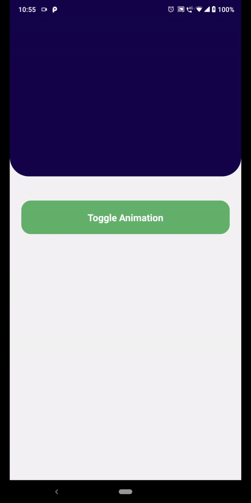

<p align="center">
</p>
<h2 align="center">
  An Simple Parallax Animation to React Native! 🚀
</h2>

<br>

<div align="center">
<p>
  
  <a href="https://twitter.com/marcelxsilva" target="_blank">
    
  </a>

[](https://github.com/Naereen/StrapDown.js/blob/master/LICENSE)
[](https://github.com/ellerbrock/open-source-badges/)

</p>
</div>

---

<p align='center' >
<i>
The key to change is to focus all your energy not on fighting the old, but on building the new
</i>
</p>

_Not available for React JS

---
> ## Demo

<div style="display: flex">



</div>

> ## Instalation

### Yarn

```
  yarn add react-native-animation-parallax
```

### Npm

```
  npm i react-native-animation-parallax
```

## Code Example

```javascript
import React from 'react';
import { Button, Text } from 'react-native';
import { Parallax, toggleAnimation } from 'react-native-animation-parallax';

export default function Home() {
  return (
    <>
      <Parallax style={{
        backgroundColor: 'blue',
        borderBottomLeftRadius: 20,
        borderBottomRightRadius: 20,
      }}>
        <Text>Hello World!</Text>
      </Parallax>
      
      <Button title="Toggle Animation" onPress={toggleAnimation} />
    </>
  );
}

```

> ## Props
<code>Parallax</code> - Component like any other, internally is an Animated.View

<code>toggleAnimation</code> - method to decrease and increase the size of Parallax

## Need help?

If you need help with Socrates Template, feel free to open an issue with a description of the problem you're facing.

## License

MIT ©

## Author

- Marcelo Silva

Twitter: [@marcelxsilva](https://github.com/marcelxsilva)
